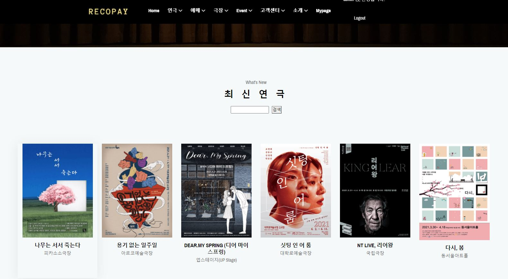
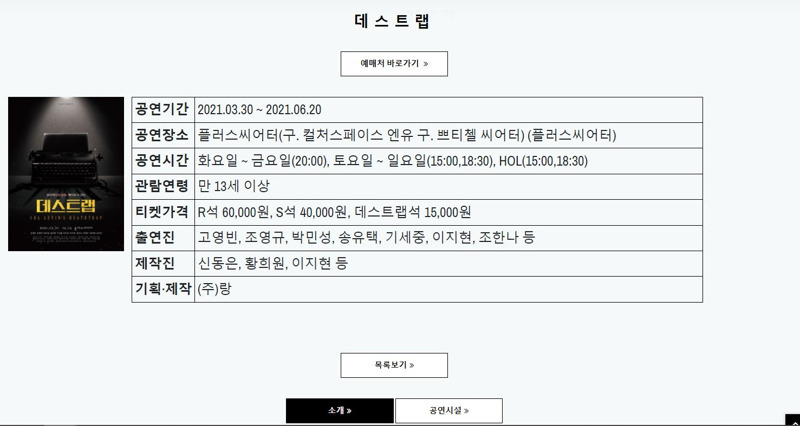

# RecoPAY - 추천 결제 시스템
## 프로젝트 계획 이유
일단은 무언가를 만들어보자는 의지가 강한 저희 팀은 여러 API를 확인한 결과 많은 정보를 제공하는 공연예술통합전산망(KOPIS)에서 제공하는 OPEN API를 사용하기로 결정하였습니다. 본 취지는 API를 사용해서 DB를 구축하고 DB에 있는 데이터를 화면에 띄우는 것과 CRUD 싸이클의 기본인 게시판을 구축하는 것이었습니다. 더 방대한 시스템을 만들고 싶은 욕구가 있었기에 결제와 추천까지 해주는 시스템을 만들자 라는 계획이 추가되었지만, 결제까지 이르지 못하고 예약을 하고 확인할 수 있는 시스템을 만들게 되었습니다.

정리하면, 연극 정보를 확인하고 해당 연극장 좌석에 예약을 하고 마이페이지에서 확인할 수 있습니다. 그리고 본 작품에 대해서는 평가가 가능하고 좋게 평가한 작품에 대해서는 비슷한 작품을 추천받을 수 있는 구조입니다.

## 프로젝트 기능 설명

### [연극소개] 

 </img> 

- 연극 검색 기능
- 최신 연극 확인 

 </img> 

- 관심있는 연극에 대한 정보를 확인할 수 있는 디테일 페이지
- 

### [극장소개] 

### [예매하기] 

